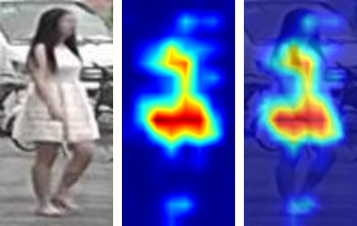

How-to
============

.. contents::
   :local:

Prepare datasets
-----------------
See :ref:`datasets`.

Find model keys
-----------------
Keys are listed under the *Public keys* section within each model class in :ref:`torchreid_models`.

Show available models
----------------------

.. code-block:: python

    import torchreid
    torchreid.models.show_avai_models()

Change the training sampler
-----------------------------
The default ``train_sampler`` is "RandomSampler". You can give the specific sampler name as input to ``train_sampler``, e.g. ``train_sampler='RandomIdentitySampler'`` for triplet loss.

Choose an optimizer/lr_scheduler
----------------------------------
Please refer to the source code of ``build_optimizer``/``build_lr_scheduler`` in :ref:`torchreid_optim` for details.

Resume training
----------------
Suppose the checkpoint is saved in "log/resnet50/model.pth.tar-30", you can do

.. code-block:: python

    start_epoch = torchreid.utils.resume_from_checkpoint(
        'log/resnet50/model.pth.tar-30',
        model,
        optimizer
    )

    engine.run(
        save_dir='log/resnet50',
        max_epoch=60,
        start_epoch=start_epoch
    )

Compute model complexity
--------------------------
We provide a tool in ``torchreid.utils.model_complexity.py`` to automatically compute the model complexity, i.e. number of parameters and FLOPs.

.. code-block:: python

    from supervision.tracker.stronsort_tracker.torchreid import models, utils

    model = models.build_model(name='resnet50', num_classes=1000)
    num_params, flops = utils.compute_model_complexity(model, (1, 3, 256, 128))

    # show detailed complexity for each module
    utils.compute_model_complexity(model, (1, 3, 256, 128), verbose=True)

    # count flops for all layers including ReLU and BatchNorm
    utils.compute_model_complexity(model, (1, 3, 256, 128), verbose=True, only_conv_linear=False)

Note that (1) this function only provides an estimate of the theoretical time complexity rather than the actual running time which depends on implementations and hardware; (2) the FLOPs is only counted for layers that are used at test time. This means that redundant layers such as person ID classification layer will be ignored. The inference graph depends on how you define the computations in ``forward()``.

Combine multiple datasets
---------------------------
Easy. Just give whatever datasets (keys) you want to the ``sources`` argument when instantiating a data manager. For example,

.. code-block:: python

    datamanager = torchreid.data.ImageDataManager(
        root='reid-data',
        sources=['market1501', 'dukemtmcreid', 'cuhk03', 'msmt17'],
        height=256,
        width=128,
        batch_size=32
    )

In this example, the target datasets are Market1501, DukeMTMC-reID, CUHK03 and MSMT17 as the ``targets`` argument is not specified. Please refer to ``Engine.test()`` in :ref:`torchreid_engine` for details regarding how evaluation is performed.

Do cross-dataset evaluation
-----------------------------
Easy. Just give whatever datasets (keys) you want to the argument ``targets``, like

.. code-block:: python

    datamanager = torchreid.data.ImageDataManager(
        root='reid-data',
        sources='market1501',
        targets='dukemtmcreid', # or targets='cuhk03' or targets=['dukemtmcreid', 'cuhk03']
        height=256,
        width=128,
        batch_size=32
    )

Combine train, query and gallery
---------------------------------
This can be easily done by setting ``combineall=True`` when instantiating a data manager. Below is an example of using Market1501,

.. code-block:: python

    datamanager = torchreid.data.ImageDataManager(
        root='reid-data',
        sources='market1501',
        height=256,
        width=128,
        batch_size=32,
        market1501_500k=False,
        combineall=True # it's me, here
    )

More specifically, with ``combineall=False``, you will get

.. code-block:: none

    => Loaded Market1501
      ----------------------------------------
      subset   | # ids | # images | # cameras
      ----------------------------------------
      train    |   751 |    12936 |         6
      query    |   750 |     3368 |         6
      gallery  |   751 |    15913 |         6
      ---------------------------------------

with ``combineall=True``, you will get

.. code-block:: none

    => Loaded Market1501
      ----------------------------------------
      subset   | # ids | # images | # cameras
      ----------------------------------------
      train    |  1501 |    29419 |         6
      query    |   750 |     3368 |         6
      gallery  |   751 |    15913 |         6
      ---------------------------------------

Optimize layers with different learning rates
-----------------------------------------------
A common practice for fine-tuning pretrained models is to use a smaller learning rate for base layers and a large learning rate for randomly initialized layers (referred to as ``new_layers``). ``torchreid.optim.optimizer`` has implemented such feature. What you need to do is to set ``staged_lr=True`` and give the names of ``new_layers`` such as "classifier".

Below is an example of setting different learning rates for base layers and new layers in ResNet50,

.. code-block:: python

    # New layer "classifier" has a learning rate of 0.01
    # The base layers have a learning rate of 0.001
    optimizer = torchreid.optim.build_optimizer(
        model,
        optim='sgd',
        lr=0.01,
        staged_lr=True,
        new_layers='classifier',
        base_lr_mult=0.1
    )

Please refer to :ref:`torchreid_optim` for more details.

Do two-stepped transfer learning
-------------------------------------
To prevent the pretrained layers from being damaged by harmful gradients back-propagated from randomly initialized layers, one can adopt the *two-stepped transfer learning strategy* presented in `Deep Transfer Learning for Person Re-identification <https://arxiv.org/abs/1611.05244>`_. The basic idea is to pretrain the randomly initialized layers for few epochs while keeping the base layers frozen before training all layers end-to-end.

This has been implemented in ``Engine.train()`` (see :ref:`torchreid_engine`). The arguments related to this feature are ``fixbase_epoch`` and ``open_layers``. Intuitively, ``fixbase_epoch`` denotes the number of epochs to keep the base layers frozen; ``open_layers`` means which layer is open for training.

For example, say you want to pretrain the classification layer named "classifier" in ResNet50 for 5 epochs before training all layers, you can do

.. code-block:: python

    engine.run(
        save_dir='log/resnet50',
        max_epoch=60,
        eval_freq=10,
        print_freq=10,
        test_only=False,
        fixbase_epoch=5,
        open_layers='classifier'
    )
    # or open_layers=['fc', 'classifier'] if there is another fc layer that
    # is randomly initialized, like resnet50_fc512

Note that ``fixbase_epoch`` is counted into ``max_epoch``. In the above example, the base network will be fixed for 5 epochs and then open for training for 55 epochs. Thus, if you want to freeze some layers throughout the training, what you can do is to set ``fixbase_epoch`` equal to ``max_epoch`` and put the layer names in ``open_layers`` which you want to train.

Test a trained model
----------------------
You can load a trained model using :code:`torchreid.utils.load_pretrained_weights(model, weight_path)` and set ``test_only=True`` in ``engine.run()``.

Fine-tune a model pre-trained on reid datasets
-----------------------------------------------
Use :code:`torchreid.utils.load_pretrained_weights(model, weight_path)` to load the pre-trained weights and then fine-tune on the dataset you want.

Visualize learning curves with tensorboard
--------------------------------------------
The ``SummaryWriter()`` for tensorboard will be automatically initialized in ``engine.run()`` when you are training your model. Therefore, you do not need to do extra jobs. After the training is done, the ``*tf.events*`` file will be saved in ``save_dir``. Then, you just call ``tensorboard --logdir=your_save_dir`` in your terminal and visit ``http://localhost:6006/`` in a web browser. See `pytorch tensorboard <https://pytorch.org/docs/stable/tensorboard.html>`_ for further information.

Visualize ranking results
---------------------------
This can be achieved by setting ``visrank`` to true in ``engine.run()``. ``visrank_topk`` determines the top-k images to be visualized (Default is ``visrank_topk=10``). Note that ``visrank`` can only be used in test mode, i.e. ``test_only=True`` in ``engine.run()``. The output will be saved under ``save_dir/visrank_DATASETNAME`` where each plot contains the top-k similar gallery images given a query. An example is shown below where red and green denote incorrect and correct matches respectively.

Visualize activation maps
--------------------------
To understand where the CNN focuses on to extract features for ReID, you can visualize the activation maps as in `OSNet <https://arxiv.org/abs/1905.00953>`_. This is implemented in ``tools/visualize_actmap.py`` (check the code for more details). An example running command is

.. code-block:: shell

    python tools/visualize_actmap.py \
    --root $DATA/reid \
    -d market1501 \
    -m osnet_x1_0 \
    --weights PATH_TO_PRETRAINED_WEIGHTS \
    --save-dir log/visactmap_osnet_x1_0_market1501

The output will look like (from left to right: image, activation map, overlapped image)

.. note::
    In order to visualize activation maps, the CNN needs to output the last convolutional feature maps at eval mode. See ``torchreid/models/osnet.py`` for example.

Use your own dataset
----------------------
1. Write your own dataset class. Below is a template for image dataset. However, it can also be applied to a video dataset class, for which you simply change ``ImageDataset`` to ``VideoDataset``.

.. code-block:: python

    from __future__ import absolute_import
    from __future__ import print_function
    from __future__ import division

    import sys
    import os
    import os.path as osp

    from supervision.tracker.stronsort_tracker.torchreid.data import ImageDataset

    class NewDataset(ImageDataset):
        dataset_dir = 'new_dataset'

        def __init__(self, root='', **kwargs):
            self.root = osp.abspath(osp.expanduser(root))
            self.dataset_dir = osp.join(self.root, self.dataset_dir)

            # All you need to do here is to generate three lists,
            # which are train, query and gallery.
            # Each list contains tuples of (img_path, pid, camid),
            # where
            # - img_path (str): absolute path to an image.
            # - pid (int): person ID, e.g. 0, 1.
            # - camid (int): camera ID, e.g. 0, 1.
            # Note that
            # - pid and camid should be 0-based.
            # - query and gallery should share the same pid scope (e.g.
            #   pid=0 in query refers to the same person as pid=0 in gallery).
            # - train, query and gallery share the same camid scope (e.g.
            #   camid=0 in train refers to the same camera as camid=0
            #   in query/gallery).
            train = ...
            query = ...
            gallery = ...

            super(NewDataset, self).__init__(train, query, gallery, **kwargs)

2. Register your dataset.

.. code-block:: python

    import torchreid
    torchreid.data.register_image_dataset('new_dataset', NewDataset)

3. Initialize a data manager with your dataset.

.. code-block:: python

    # use your own dataset only
    datamanager = torchreid.data.ImageDataManager(
        root='reid-data',
        sources='new_dataset'
    )
    # combine with other datasets
    datamanager = torchreid.data.ImageDataManager(
        root='reid-data',
        sources=['new_dataset', 'dukemtmcreid']
    )
    # cross-dataset evaluation
    datamanager = torchreid.data.ImageDataManager(
        root='reid-data',
        sources=['new_dataset', 'dukemtmcreid'],
        targets='market1501' # or targets=['market1501', 'cuhk03']
    )

Design your own Engine
------------------------
A new Engine should be designed if you have your own loss function. The base Engine class ``torchreid.engine.Engine`` has implemented some generic methods which you can inherit to avoid re-writing. Please refer to the source code for more details. You are suggested to see how ``ImageSoftmaxEngine`` and ``ImageTripletEngine`` are constructed (also ``VideoSoftmaxEngine`` and ``VideoTripletEngine``). All you need to implement might be just a ``forward_backward()`` function.

Use Torchreid as a feature extractor in your projects
-------------------------------------------------------
We have provided a simple API for feature extraction, which accepts input of various types such as a list of image paths or numpy arrays. More details can be found in the code at ``torchreid/utils/feature_extractor.py``. Here we show a simple example of how to extract features given a list of image paths.

.. code-block:: python

    from supervision.tracker.stronsort_tracker.torchreid.utils import FeatureExtractor

    extractor = FeatureExtractor(
        model_name='osnet_x1_0',
        model_path='a/b/c/model.pth.tar',
        device='cuda'
    )

    image_list = [
        'a/b/c/image001.jpg',
        'a/b/c/image002.jpg',
        'a/b/c/image003.jpg',
        'a/b/c/image004.jpg',
        'a/b/c/image005.jpg'
    ]

    features = extractor(image_list)
    print(features.shape) # output (5, 512)
